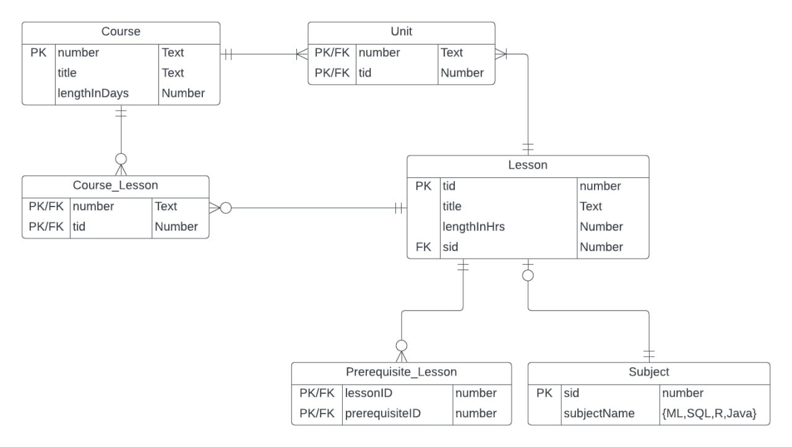

## Schema Overview




## Initialize

Import RSQLite lib and create database connection, need to point to the directory that we want to save the .sqlite db file. 
```{r}
library(RSQLite)


fpath = "C:/Users/aggha/Desktop/DatabaseAssignment03/"
dbfile = "course.sqlite"

dbcon <- dbConnect(RSQLite::SQLite(), paste0(fpath, dbfile))
```

```{sql connection=dbcon}
PRAGMA foreign_keys=ON;
```
## [Optional]

Drop tables if they are already created.
```{sql connection=dbcon}
drop table if exists Course_Lesson;
```

```{sql connection=dbcon}
drop table if exists Unit;
```

```{sql connection=dbcon}
drop table if exists Prerequisite_Lesson;
```

```{sql connection=dbcon}
drop table if exists Lesson;
```

```{sql connection=dbcon}
drop table if exists Subject;
```

```{sql connection=dbcon}
drop table if exists Course;
```

## Tables

Course Table
Assumed that all courses should have unique title and take between 1 to 100 days.
```{sql connection=dbcon}
CREATE TABLE Course(
 [number] TEXT NOT NULL,
 [title] TEXT NOT NULL UNIQUE,
 [lengthInDays] INTEGER NOT NULL CHECK(lengthInDays > 0 AND lengthInDays < 101),
 PRIMARY KEY ([number])
)
```

Constraint check for Course's lengthInDays (code in RMD file)
```{sql connection=dbcon}
INSERT INTO Course([number], [title], [lengthInDays]) VALUES ('CS001', 'Database', 0);
```

Subject Table
This table can be considered as a look-up table.
```{sql connection=dbcon}
CREATE TABLE Subject(
  [sid] INTEGER NOT NULL,
  [subjectName] TEXT NOT NULL CHECK(subjectName in ('ML', 'SQL', 'R', 'Java')),
  PRIMARY KEY([sid])
)
```

Constraint check for Subject's categories (code in RMD file)
```{sql connection=dbcon}
INSERT INTO Subject([sid], [subjectName]) VALUES (9999, 'Python');
```


Lesson Table
Assumed that lessons take 1 to 6 hours.
```{sql connection=dbcon}
 CREATE TABLE Lesson(
 [tid] INTEGER NOT NULL,
 [title] TEXT NOT NULL UNIQUE,
 [lengthInHrs] INTEGER NOT NULL CHECK(lengthInHrs > 0 AND lengthInHrs < 7),
 [sid] INTEGER NOT NULL,
 PRIMARY KEY ([tid]),
 FOREIGN KEY ([sid]) REFERENCES Subject([sid])
)
```

Constraint check for Lesson's lengthInHrs (code in RMD file)
```{sql connection=dbcon}
INSERT INTO Lesson([tid], [title], [lengthInHrs], [sid]) VALUES (9999, 'Programming', 8, 8888);
```

Prerequisite_Lesson Table

Since a lesson can have zero or more prerequisite lessons and a lesson can be a prereq for zero or more lessons, we can store [sid] key pairs as composite key from Lesson table. One is for lesson and another is prerequisite of that lesson.
```{sql connection=dbcon}
 CREATE TABLE Prerequisite_Lesson(
 [lessonID] INTEGER NOT NULL,
 [prerequisiteID] INTEGER NOT NULL,
 PRIMARY KEY ([lessonID], [prerequisiteID]),
 FOREIGN KEY ([lessonID]) REFERENCES Lesson([tid]),
 FOREIGN KEY ([prerequisiteID]) REFERENCES Lesson([tid])
)
``` 

Unit Table
```{sql connection=dbcon}
CREATE TABLE Unit(
 [number] TEXT NOT NULL,
 [tid] INTEGER NOT NULL,
 PRIMARY KEY([number], [tid]),
 FOREIGN KEY ([number]) REFERENCES Course([number]),
 FOREIGN KEY ([tid]) REFERENCES Lesson([tid])
)
```

Course_Lesson Table
We need this table because one course may have zero or more lessons and one lesson may be in zero or more courses. This is different from Unit Table which is a separate entity that records Unit info. We have made an assumption that we cannot know lessons without courses OR courses without lessons by using the Unit table alone.
```{sql connection=dbcon}
CREATE TABLE Course_Lesson(
[number] TEXT NOT NULL,
[tid] INTEGER NOT NULL,
PRIMARY KEY([number], [tid]),
FOREIGN KEY ([number]) REFERENCES Course([number]),
FOREIGN KEY ([tid]) REFERENCES Lesson([tid])
)
```

Close db connection
```{r}
dbDisconnect(dbcon)
```


